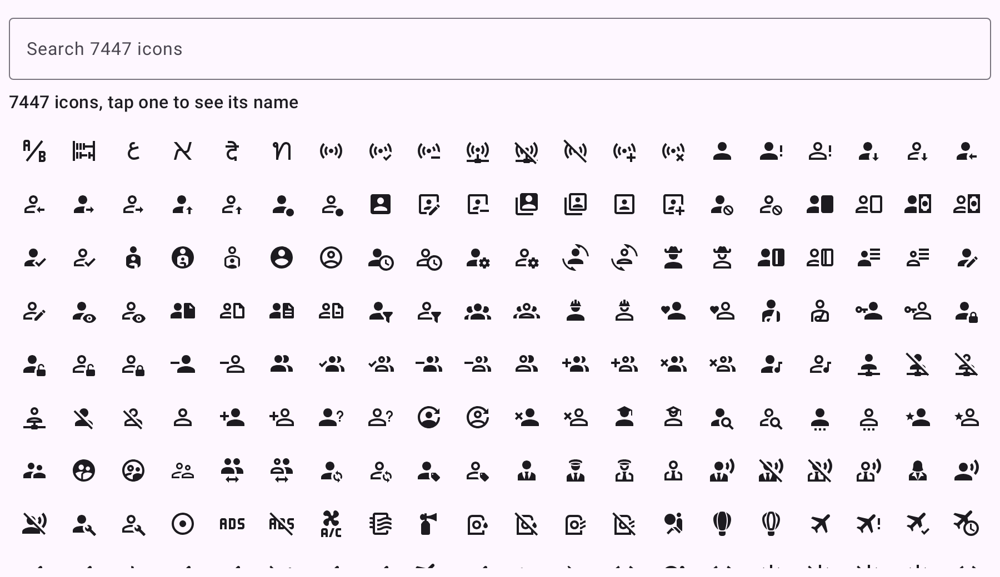
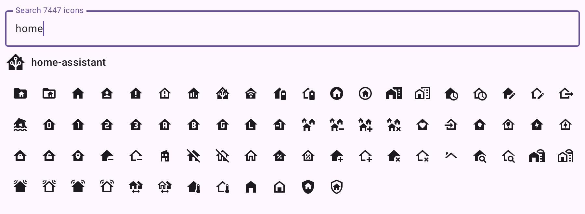

# mdi-icons

[](https://central.sonatype.com/artifact/io.github.timoptr/mdi-icons)
[](https://timoptr.github.io/mdi-icons/)

A Compose Multiplatform library exposing the full [Material Design Icons](https://pictogrammers.com/library/mdi/)
(MDI) catalog as Kotlin, targeting Android, iOS, desktop (JVM), JS and wasm.

**[Browse the catalog in your browser](https://timoptr.github.io/mdi-icons/)**: the sample app from this
repository, running on Compose for web.



## Installation

The library is published on [Maven Central](https://central.sonatype.com/artifact/io.github.timoptr/mdi-icons):

```kotlin
dependencies {
    implementation("io.github.timoptr:mdi-icons:0.2.0")
}
```

In a Compose Multiplatform project, add it to the `commonMain` source set instead:

```kotlin
kotlin {
    sourceSets {
        commonMain.dependencies {
            implementation("io.github.timoptr:mdi-icons:0.2.0")
        }
    }
}
```

## Usage

### Show an icon you know at compile time

Every icon has a generated accessor on `Mdi`, named after the icon in PascalCase. Accessors are
extension properties in the `io.github.timoptr.mdiicons.generated` package, so the IDE imports
each one you use:

```kotlin
import io.github.timoptr.mdiicons.Mdi
import io.github.timoptr.mdiicons.generated.HomeAssistant
import io.github.timoptr.mdiicons.rememberImageVector

@Composable
fun HomeIcon() {
    Icon(
        imageVector = Mdi.HomeAssistant.rememberImageVector(),
        contentDescription = "Home Assistant",
    )
}
```

The result is a regular `ImageVector`, so it works with `Icon`, `Image` and tinting like the
Material icons.

### Resolve an icon name received at runtime

Names coming from a server or user settings resolve with `fromMdiName`, which takes the name
without the `mdi:` prefix. Aliases and historical renames are followed; unknown or removed names return `null`,
so you choose the fallback:

```kotlin
val icon = Mdi.fromMdiName("lightbulb-on") ?: Mdi.HelpCircle

Icon(imageVector = icon.rememberImageVector(), contentDescription = null)
```



### Mirror directional icons in right-to-left layouts

```kotlin
Icon(
    imageVector = Mdi.ArrowLeft.rememberImageVector(autoMirror = true),
    contentDescription = "Back",
)
```

### List the whole catalog

For an icon picker, `Mdi.icons` returns every icon:

```kotlin
LazyVerticalGrid(columns = GridCells.Adaptive(minSize = 44.dp)) {
    items(Mdi.icons, key = MdiIcon::name) { icon ->
        Icon(imageVector = icon.rememberImageVector(), contentDescription = icon.name)
    }
}
```

### Draw into a `Bitmap` on Android

For notifications, quick settings tiles, widgets or Android Auto, which cannot render Compose:

```kotlin
val bitmap = Mdi.HomeAssistant.toBitmap(context, sizeDp = 24, color = Color.WHITE)

NotificationCompat.Builder(context, channelId)
    .setLargeIcon(bitmap)
```

## Who this is for

This library is for Compose Multiplatform (and Kotlin/Compose Android) projects: icons are
exposed as Compose `ImageVector`s and looked up by the icon names. It is not
aimed at other ecosystems (not using Compose Multiplatform), which have better native options for the same upstream data:

- Plain websites: use [`@mdi/js`](https://pictogrammers.com/docs/guides/webfont-alternatives/)
  from npm, tree-shakeable and idiomatic.
- Native Swift apps: render the [`@mdi/svg`](https://www.npmjs.com/package/@mdi/svg) assets
  directly, as the Home Assistant iOS app does with its own generated catalog.

## Why this library exists

The Home Assistant Android app used [Android-Iconics](https://github.com/mikepenz/Android-Iconics) with the
`community-material-typeface` to render MDI icons. That approach reached a dead end:

- Android-Iconics is [in maintenance mode](https://github.com/mikepenz/Android-Iconics#-android-iconics-is-in-maintenance-mode)
  and ships no new icon fonts; its author
  [recommends migrating away](https://github.com/mikepenz/Android-Iconics#migrating-away-from-android-iconics).
- The bundled typeface is frozen at MDI 7.0.96 (2022).
- Iconics is Android-only.

This library replaces all of that with a small, owned pipeline over the canonical data.

## What it brings

- The complete MDI catalog, generated from the pinned `@mdi/svg` version.
- Runtime lookup by name, including the `meta.json` aliases and the historical renames.
  Unknown or removed icons resolve to `null` so callers pick their own fallback.
- Compile-time safe accessors for static usage, one `val` per icon.
- Rendering as first-class Compose `ImageVector`s, identical to the frontend's path-based
  rendering.
- RTL support for directional icons, like the Material `AutoMirrored` icons. MDI carries no
  per-icon RTL metadata, so mirroring is opted into per call site.
- Android-only `toBitmap` extensions for surfaces that cannot render Compose.
- An update pipeline: `./gradlew :shared:updateMdiIcons` regenerates the catalog from the version
  pinned in `gradle/libs.versions.toml`, verified against the npm registry checksum. Renovate
  watches the pin, and `verifyMdiIcons` fails CI until the catalog is regenerated after a bump.

## Footprint: APK, dex and RAM

Shipping the catalog as Kotlin trades binary size against an updatable, multiplatform library.
Measured on the Home Assistant Android app (release build), replacing Iconics and its typeface
with this catalog:

| Metric | Impact | Notes |
| --- | --- | --- |
| APK download size | +0.6 MB | The ~2.5 MB of path strings compress well; removing the 1.3 MB font offsets most of it |
| Raw dex (install size) | +4 MB | Each icon costs its path data plus roughly 800 bytes of dex structure for the accessor `val` |
| RAM | pay per use | See below; the previous typeface enums held 1 to 1.5 MB of heap unconditionally |

The dex cost is the price of one accessor per icon. Icon fonts remain the most byte-efficient
encoding for mono-color icon sets (the font is memory mapped, so glyph shapes never touch the
Java heap either); this library deliberately spends those bytes on the canonical data format,
compile-time safety and `ImageVector` rendering.

### RAM

The catalog is split into alphabetically sorted chunks, and a lookup loads only the chunk
holding the requested name (binary search over the chunks' first names).

Measured retained heap on the JVM, first use from a cold catalog:

| Scenario | Retained |
| --- | --- |
| Single icon lookup | ~280 KiB |
| Six lookups spread across six different chunks (adversarial) | ~1.6 MiB |
| Listing the full catalog through `Mdi.icons` (icon picker) | ~3.9 MiB |

Typical sessions resolve icons that cluster alphabetically, so real usage sits between the first
two rows. The alias and rename tables load only when a lookup misses the canonical names.

`ImageVector`s are deliberately not cached in the library. `rememberImageVector()` scopes them to
the composition, so vectors exist only while their icon is on screen. A screen listing the whole
catalog pays for what it shows and releases it on dispose; nothing accumulates for the lifetime
of the process. `toBitmap` likewise returns a fresh bitmap on each call because its consumers
immediately parcel it to a system surface.

## Publishing

The library publishes to Maven Central as `io.github.timoptr:mdi-icons` through the
[vanniktech maven publish plugin](https://vanniktech.github.io/gradle-maven-publish-plugin/),
following the [Kotlin Multiplatform publishing guide](https://kotlinlang.org/docs/multiplatform/multiplatform-publish-libraries-to-maven.html).
One publication covers every target: Android, iOS (arm64 and simulator), desktop (JVM), JS and wasm.

## Updating the icons

```shell
./gradlew :shared:updateMdiIcons   # regenerate from the pinned @mdi/svg version
./gradlew :shared:verifyMdiIcons   # check the generated catalog matches the pin
```

The version is pinned in `gradle/libs.versions.toml` under `mdi-svg` with a Renovate annotation.

## Updating the README screenshots

The images in `docs/images` are [Roborazzi](https://github.com/takahirom/roborazzi) screenshot tests of
the sample app, rendered with Robolectric:

```shell
./gradlew :sample:recordRoborazziAndroidHostTest   # re-record after a sample UI change
./gradlew :sample:verifyRoborazziAndroidHostTest   # check the images still match the app
```
